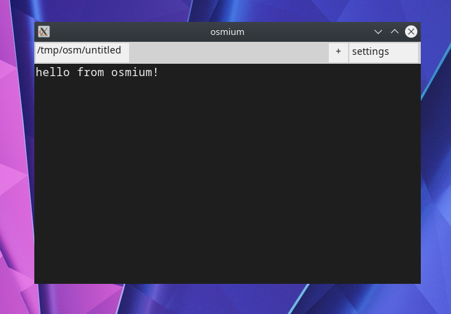

# osmuim

osmium is a text editor. it should be usable as a full ide and hotfix editor:
- start very quickly
- run on at least windows and linux
- have tabs if not a full file tree
- also support running terminals
- be customizable
  - fonts, colours, etc
  - things like `bind ctrl+g "make && ./program"`
- not make me want to vomit
  - syntax highlighting
  - word wrap

## installing
do `make linux` or `make win`

requires sdl2, sdl_ttf, c (gcc/mingw), go

for windows builds, make sure you have [sdl](https://github.com/libsdl-org/SDL/releases/) and [sdl2_ttf](https://github.com/libsdl-org/SDL_ttf/releases/) copied to `/opt/local/x86_64-w64-mingw32/`
